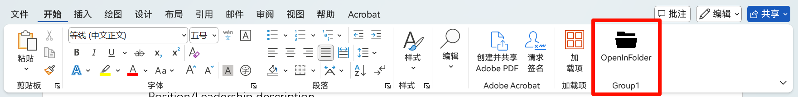

# WordAddins
Some practical word addins, to facilitate your editing   
**高中个人开发小小项目**
实用的word加载项（插件），用于丰富功能   
使用**C# + WinForm**开发

### 重要
**因为微软OneDrive的引用，对于在OneDrive位置（包含d.docs.live.net）保存的文件需要一步特殊处理（获取到的路径为云端路径，需要转换成本地路径），如果你使用Onedrive，需要根据自己OneDrive的位置更改，如果不使用OneDrive，请忽略此条**

# Update Logs:
## v1.0.0--2024/12/30
打开当前文件的位置，打开文件夹   

